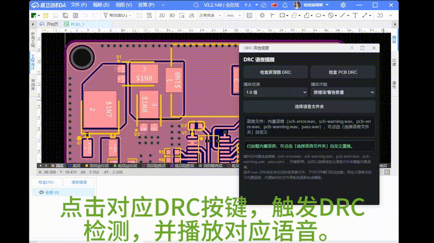

# DRC 语音提醒

立创 EDA 专业版（嘉立创 EDA）扩展插件：原理图 / PCB 执行 DRC 检查后，按错误数、警告数播放对应语音提示（**内置合成语音，开箱即用**，也可自定义本地 `wav` 语音文件；无错误无警告时播报「咸鱼翻身啦！」）。

> [!NOTE]
> **内置语音已随插件打包**：插件自带全部合成语音文件（`sch-error.wav`、`sch-warning.wav`、`pcb-error.wav`、`pcb-warning.wav`、`pass.wav`），导入插件后无需额外选择文件夹即可直接使用。如需替换为自定义语音，按下方「语音文件命名规则」选择自己的语音文件夹即可覆盖。

## 功能特性

- 一键检查：分别触发**原理图 DRC** 与 **PCB DRC** 检测，检查后**自动呼出 EDA 自带 DRC 结果窗口**展示明细。
- 语音播报：
  - 每个错误播放错误提示音，每个警告播放警告提示音（按数量）；
  - 也可选择「只播放一次」模式；
  - 无任何错误/警告时播放通过提示音（默认文案「咸鱼翻身啦！」）。
- 播放倍速设置：0.5x / 0.75x / 1.0x / 1.25x / 1.5x / 2.0x。
- **内置语音**：随插件打包，导入即用，无需手动选择语音文件夹。
- 自定义语音：选择本地语音文件夹，自动按文件名匹配，**优先于内置语音**；选择后自动记住，下次打开窗口自动加载。
- 未加载或缺失语音文件时，自动使用系统语音合成播报对应语句。

## 效果演示



## 下载

从 [GitHub Releases](https://github.com/RockW-ZzZ/jlceda-DRC-fail-flash/releases) 获取最新发布版本：

| 文件 | 说明 |
| --- | --- |
| `drc-voice-alert_v<版本号>.eext` | 插件本体（**已内置合成语音**），在立创 EDA 专业版「扩展管理器」中导入即可使用 |

## 安装方法

1. 构建或在 `build/dist/` 目录获取扩展包 `drc-voice-alert_v<版本号>.eext`。
2. 打开立创 EDA 专业版：
   - **V2**：顶部菜单 → 设置 → 扩展 → 扩展管理器… → 导入；
   - **V3**：顶部菜单 → 高级 → 扩展管理器… → 导入。
3. 选择 `.eext` 文件完成导入。

## 使用方法

1. 顶部菜单找到 **DRC 语音提醒** 菜单项（首页 / 原理图 / PCB 页面均有）并点击，打开插件窗口。
2. **直接使用内置语音**：插件已内置全部合成语音，窗口状态栏显示「内置语音」即可开始使用，无需额外配置。
3. （可选）**自定义语音**：点击「选择语音文件夹」按钮，选中存放语音文件的文件夹（如仓库的 `wav` 目录）。
   - 窗口会按文件名自动匹配语音文件，并记住选择；**下次打开窗口自动加载**，无需重新选择。
   - 自定义语音优先于内置语音；若当前环境不支持选择文件夹（浏览器限制），可仅依赖内置语音或系统语音合成兜底。
4. 按需设置：
   - **播放倍速**：选择播放速度。
   - **播放次数**：`按错误/警告数量`（每个问题播一次对应语音）或 `只播放一次`（每类问题最多播一次）。
5. 打开待检查的原理图或 PCB，点击窗口中的 **检查原理图 DRC** 或 **检查 PCB DRC** 按钮；检查完成后 EDA 底部自动显示 DRC 结果窗口并播报语音。

## 语音文件命名规则

插件已内置以下语音（`wav/` 目录），开箱即用。如需自定义语音，将语音文件放在同一文件夹内，文件名（小写）必须与下表一致，插件自动匹配并覆盖内置语音：

| 场景 | 文件名 | 兜底播报文案 |
| --- | --- | --- |
| 原理图错误 | `sch-error.wav` | 原理图有错误，杂鱼！ |
| 原理图警告 | `sch-warning.wav` | 原理图有警告，杂鱼！ |
| PCB 错误 | `pcb-error.wav` | PCB有错误，杂鱼！ |
| PCB 警告 | `pcb-warning.wav` | PCB有警告，杂鱼！ |
| 通过（无错误无警告） | `pass.wav`（可选） | 咸鱼翻身啦！ |

说明：

- 文件夹内多余文件会被忽略；缺哪个文件，该场景就用系统语音合成播报。
- 每次选择文件夹后，语音文件内容会保存在浏览器本地（IndexedDB），下次打开窗口自动加载，与路径/权限无关。

## 常见问题

**Q：只听到一次声音，没有按数量播放？**
A：请确认窗口「播放次数」为「按错误/警告数量」。若状态栏显示的「错误 X 个」与实际不符，请打开调试模式（编辑器 URL 加 `?cll=debug`，连按 F12 三次），查看控制台 `[DRC 语音提醒]` 开头的日志并反馈。

**Q：打开窗口没有自动加载上次的语音？**
A：重新点一次「选择语音文件夹」选中文件夹即可；之后每次打开窗口会自动加载。

**Q：网页版无法选择文件夹？**
A：「选择语音文件夹」依赖浏览器文件选择能力，若环境不支持，可改用系统语音合成兜底（不选文件夹即可），或使用桌面客户端。

**Q：播放需要点击触发？**
A：浏览器自动播放策略限制，声音播放由按钮点击触发；首次点击后音频上下文即已解锁。

## 开发与构建

需要 Node.js >= 20。

```bash
npm install
npm run build   # 产出 build/dist/drc-voice-alert_v<版本号>.eext
```

修改 `extension.json` 的 `version` 字段后重新构建、重新导入即可更新插件。

## 目录结构

```
├── src/index.ts            # 入口：打开插件窗口（openDrcVoiceWindow）
├── iframe/index.html       # 插件 UI 与 DRC/播放逻辑
├── wav/                    # 语音文件（可自备，命名见上表）
├── extension.json          # 扩展配置与菜单注册
└── build/dist/             # 构建产物（.eext）
```

## 许可

MIT License
